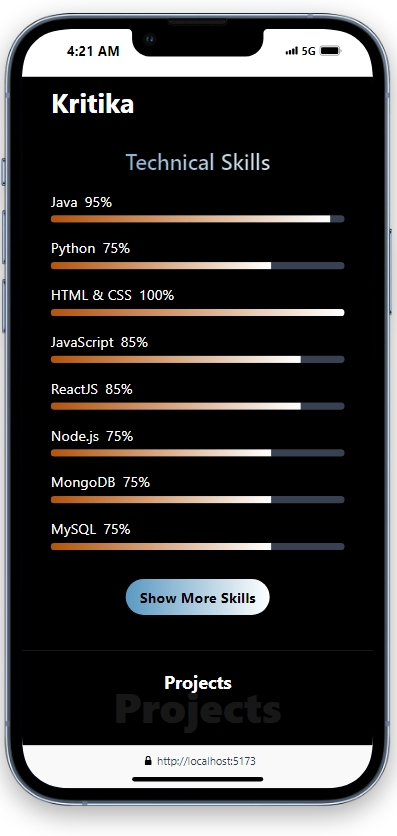

# Portfolio

Showcasing my skills and projects in web development with HTML, CSS, JavaScript, React, Node.js, and Express.

## Table of Contents

- [Project Purpose](#project-purpose)
- [Technologies](#technologies)
- [Video Overview](#video-overview)
- [Quick Tour](#quick-tour)
- [How to run the app](#how-to-run-the-app)

## Project Purpose

- Showcase Projects and Skills: Display a range of projects and technical skills in web development.
- User-Friendly Interface: Create an intuitive and interactive experience using HTML, CSS, JavaScript, and React.
- Backend Functionality: Implement robust server-side features with Node.js and Express.
- Secure Feedback Submission: Allow users to submit feedback securely using Google OAuth 2.0 for authentication and Nodemailer for email communication.
- Client and Employer Interaction: Provide a seamless way for potential clients or employers to get in touch.

## Technologies

- HTML5
- CSS3
- ECMAScript 2023
- React
- Tailwind CSS
- Node.js
- Express.js
- Nodemailer
- Google OAuth 2.0

## Video Overview

<h2 align="center">Demo Video</h2>

https://github.com/user-attachments/assets/c2ef2d1f-8f7e-4611-b5c2-a6da97c0417b


## Quick Tour

<h2 align="center">Responsive Admin Dashboard</h2>
<p align="center">
    
    
    
</p>

<h2 align="center">Responsive Design</h2>
<p align="center">
    
    
    
</p>


## How to Run the App

1. **Download the Code**
2. **Set Up Google OAuth 2.0**

   - Go to [Google Cloud Console](https://console.cloud.google.com) and create a new project.
   - Create a `.env` file in the `/server` directory with the following content:

     ```env
     CLIENT_ID='your-client-id'
     CLIENT_SECRET='your-client-secret'
     REDIRECT_URI='https://developers.google.com/oauthplayground'
     REFRESH_TOKEN='your-refresh-token'
     EMAIL='receiver-email-id'
     PORT=8000
     ```

3. **Start the Backend Server**

   ```bash
   cd server
   npm install
   npm start
   ```
